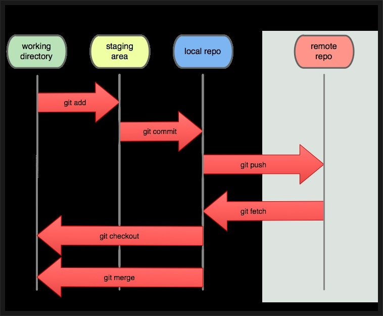
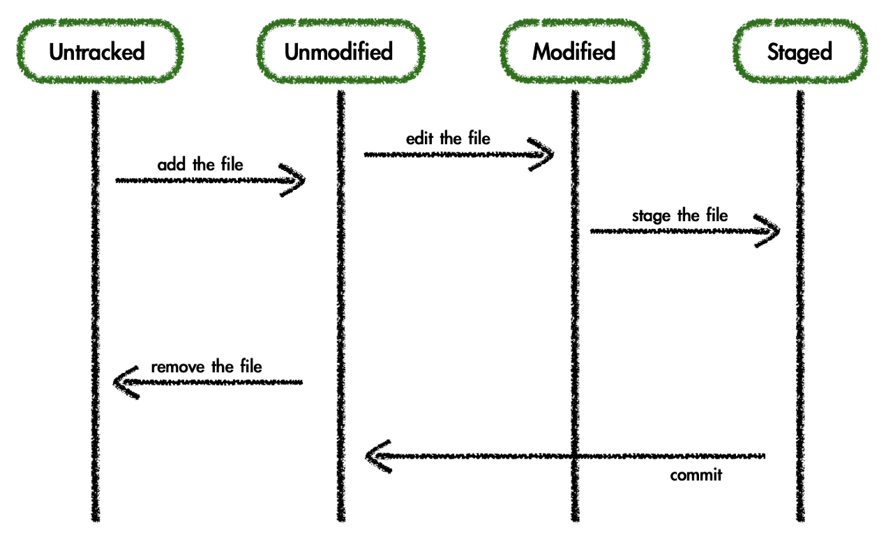

<!-- ref : https://git-scm.com/book/ko/v2/%EC%8B%9C%EC%9E%91%ED%95%98%EA%B8%B0-%EB%B2%84%EC%A0%84-%EA%B4%80%EB%A6%AC%EB%9E%80%3F -->

# staging area

- working directory : 현재 작업하는 프로젝트 디렉토리 (ex. nomadcoder/SE)

- Staging Area : 커밋을 하기 위해 git add 명령어로 추가한 파일들이 모여있는 공간

- repository : 커밋들이 모여있는 저장소

# git command

## git init

- local git repository initializing

## git clone [주소]

- 저장소 복제 및 다운로드

## git remote add origin [주소]

- github 주소와 연결

## git status

- 변경 사항이 있는 지 체크!

# file statue lifecycle

## git log

- 전체 로그 확인

## git add [파일 명]

- 변경 사항을 stage area에 추가

- git add -A

  - 작업 디렉토리 내의 모든 변경 내용을 몽땅 스테이지 영역으로 넘김

- git add .
  - 현재 디렉토리 내의 모든 변경 내용을 몽땅 스테이지 영역으로 넘김

## git commit -m "commit 내용 적기"

- stage area에 있는 변경사항들을 repository에 저장

## git push

1. git push origin master

   - 변경 사항 원격 서버 업로드 (origin)

## git pull

- 원격 저장소의 변경 내용을 현재 디렉토리로 가져오기

## git diff [브랜치 이름] [다른 브랜치 이름]

- 변경 내용을 merge 하기 전에 바뀐 내용 비교

## git fetch

- local과 origin 데이터를 동기화 시키기

# Branch

## git branch [브랜치 명]

- create a branch

## git checkout [브랜치 명]

- switch the branch

## git checkout -d [브랜치 명]

- local repository branch 생성

## git branch -d [브랜치 명]

- create a branch and switch the branch

## git branch

- show current branch name

## git branch

- show local branch list

1. git branch -r

   - show remote branch list

2. git branch -a

   - show all branch list

## git remote remove [name]

- disconnect remote repository

## git remote -v

- 현재 remote

# git flow

